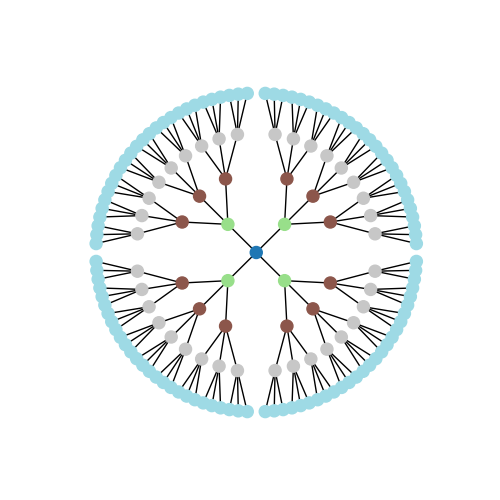
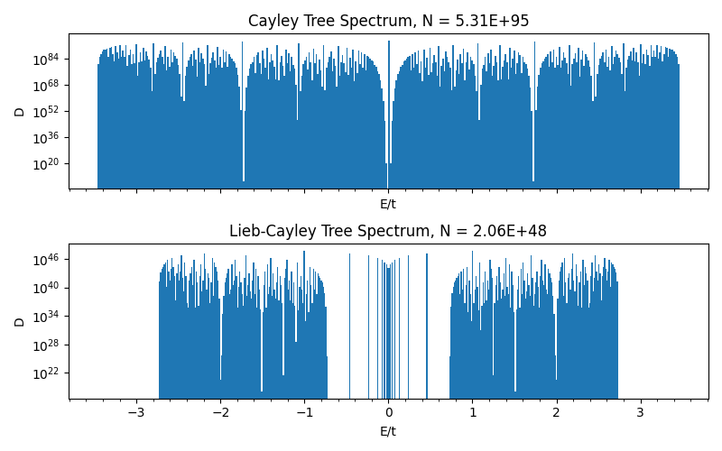

<!-- Improved compatibility of back to top link: See: https://github.com/othneildrew/Best-README-Template/pull/73 -->

<!-- PROJECT LOGO -->
 

  

  <h3 align="center">cayleytree</h3>

  

    A package to create and solve large Cayley trees!
     
    <a href="https://github.com/othneildrew/Best-README-Template">View Demo</a>
  

<!-- TABLE OF CONTENTS -->

  
Table of Contents

  <ol>
    <li>
      <a href="#about-the-project">About The Project</a>
      <ul>
        <li><a href="#built-with">Built With</a></li>
      </ul>
    </li>
    <li>
      <a href="#getting-started">Getting Started</a>
    </li>
    <li><a href="#usage">Usage</a></li>
    <li><a href="#license">License</a></li>
    <li><a href="#acknowledgments">Acknowledgments</a></li>
  </ol>

<!-- ABOUT THE PROJECT -->
## About The Project

This package provides a flexible framework to experiment with Cayley trees and variations thereof up to enourmous sizes, by using recent advances 
in our understanding of Cayley trees. This has been developed as part of the research of [Prof. Tomáš Bzdušek](https://www.physik.uzh.ch/en/groups/bzdusek/team.html) team on the topological order of hyperbolic lattices. 

Core functionalities:
* Seven Cayley tree variations have been implemented (see below), whereof five can be solved for their adjacency spectrum to almost arbitrary sizes using what is called "Mahan's approach".
* Each tree has been built on a [networkx](https://networkx.org/) graph object, allowing to experiment on it with the full power of the graph theoretical tools implemented in networkx
* Each tree comes with out-of-the-box adjacency spectrum solvers and plotting options.

(<a href="#readme-top">back to top</a>)

### Built With

This project was partially built on top of [networkx](https://github.com/networkx)

(<a href="#readme-top">back to top</a>)

<!-- GETTING STARTED -->
## Getting Started

Coming soon...

<!-- USAGE EXAMPLES -->
## Usage

cayleytree comes with some simple, out-of-the box functions to plot graphs and their
respective adjacency spectrum. To plot the chosen tree, simply use the draw() method:

    import matplotlib.pyplot as plt
    from cayleytree.IsotropicTrees import CayleyTree

    fig, ax_list = plt.subplots(1,1,sharex=True,figsize=(5,5))

    C = CayleyTree(4,3)
    C.draw(ax_list)

    plt.show()

    

To plot the spectrum of the tree, use the plot_spectrum() method. 
For isotropic trees (invariant under permutation of branches) it is possible to plot extremely large trees

    import matplotlib.pyplot as plt    
    from decimal import Decimal
    from cayleytree.IsotropicTrees import CayleyTree
    from cayleytree.IsotropicTrees import LiebCayley

    fig, ax_list = plt.subplots(2,1,sharex=True,figsize=(8,5))
    
    C = CayleyTree(200,3)
    LC = LiebCayley(200,3)
    
    C.plot_spectrum(ax_list[0],nbins=400)
    ax_list[0].set_title('Cayley Tree Spectrum, N = ' +  "{:.2E}".format(Decimal(str(C.N))))
    
    LC.plot_spectrum(ax_list[1],nbins=400)
    ax_list[1].set_title('Lieb-Cayley Tree Spectrum, N = ' +  "{:.2E}".format(Decimal(str(LC.N))))
    
    for ax in ax_list:
      ax.semilogy()

    plt.tight_layout()
    plt.show()

    

It is generally recommended to use a semilog plot for large trees, due to the high degeneracy of some eigenvalues.

Finally, if you want to work with the underlying graph object, use the "G" attribute of the tree. 
Note that if the tree has more than 4000 nodes, the tree will not instantiate the graph object unless you force it
by setting force_graph_object_creation = True. Be aware, that large trees can easily kill your RAM.

    import networkx as nx
    from cayleytree.IsotropicTrees import LiebCayley
    
    LC = LiebCayley(20,2,force_graph_object_creation = True)
    nx.diameter(LC.G)
    >>> 40

(<a href="#readme-top">back to top</a>)

<!-- LICENSE -->
## License

Distributed under the Unlicense License. See `LICENSE.txt` for more information.

(<a href="#readme-top">back to top</a>)

<!-- ACKNOWLEDGMENTS -->
## Acknowledgments

Coming soon....

(<a href="#readme-top">back to top</a>)

<!-- MARKDOWN LINKS & IMAGES -->
<!-- https://www.markdownguide.org/basic-syntax/#reference-style-links -->
[contributors-shield]: https://img.shields.io/github/contributors/othneildrew/Best-README-Template.svg?style=for-the-badge
[contributors-url]: https://github.com/othneildrew/Best-README-Template/graphs/contributors
[forks-shield]: https://img.shields.io/github/forks/othneildrew/Best-README-Template.svg?style=for-the-badge
[forks-url]: https://github.com/othneildrew/Best-README-Template/network/members
[stars-shield]: https://img.shields.io/github/stars/othneildrew/Best-README-Template.svg?style=for-the-badge
[stars-url]: https://github.com/othneildrew/Best-README-Template/stargazers
[issues-shield]: https://img.shields.io/github/issues/othneildrew/Best-README-Template.svg?style=for-the-badge
[issues-url]: https://github.com/othneildrew/Best-README-Template/issues
[license-shield]: https://img.shields.io/github/license/othneildrew/Best-README-Template.svg?style=for-the-badge
[license-url]: https://github.com/othneildrew/Best-README-Template/blob/master/LICENSE.txt
[linkedin-shield]: https://img.shields.io/badge/-LinkedIn-black.svg?style=for-the-badge&logo=linkedin&colorB=555
[linkedin-url]: https://linkedin.com/in/othneildrew
[product-screenshot]: images/screenshot.png
[Next.js]: https://img.shields.io/badge/next.js-000000?style=for-the-badge&logo=nextdotjs&logoColor=white
[Next-url]: https://nextjs.org/
[React.js]: https://img.shields.io/badge/React-20232A?style=for-the-badge&logo=react&logoColor=61DAFB
[React-url]: https://reactjs.org/
[Vue.js]: https://img.shields.io/badge/Vue.js-35495E?style=for-the-badge&logo=vuedotjs&logoColor=4FC08D
[Vue-url]: https://vuejs.org/
[Angular.io]: https://img.shields.io/badge/Angular-DD0031?style=for-the-badge&logo=angular&logoColor=white
[Angular-url]: https://angular.io/
[Svelte.dev]: https://img.shields.io/badge/Svelte-4A4A55?style=for-the-badge&logo=svelte&logoColor=FF3E00
[Svelte-url]: https://svelte.dev/
[Laravel.com]: https://img.shields.io/badge/Laravel-FF2D20?style=for-the-badge&logo=laravel&logoColor=white
[Laravel-url]: https://laravel.com
[Bootstrap.com]: https://img.shields.io/badge/Bootstrap-563D7C?style=for-the-badge&logo=bootstrap&logoColor=white
[Bootstrap-url]: https://getbootstrap.com
[JQuery.com]: https://img.shields.io/badge/jQuery-0769AD?style=for-the-badge&logo=jquery&logoColor=white
[JQuery-url]: https://jquery.com 
